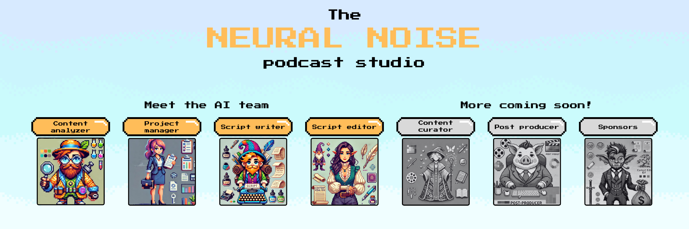

# NeuralNoise: The AI Podcast Studio

<p align="center">
    <a href="https://colab.research.google.com/drive/1-1aaRFoxJL03oUn7IB0DcfxFeWq7Vw5n?usp=sharing" alt="Open in Google Colab">
        </a>
    <a href="https://github.com/badges/shields/pulse" alt="Activity">
        </a>
    <a href="https://pypi.python.org/pypi/neuralnoise" alt="PyPI - Latest version">
        </a>
    <a href="https://pypistats.org/packages/neuralnoise" alt="Latest version">
        </a>
</p>

<div align="center">
  
</div>

NeuralNoise is an AI-powered podcast studio that uses multiple AI agents working together. These agents collaborate to analyze content, write scripts, and generate audio, creating high-quality podcast content with minimal human input. The team generates a script that the cast team (using a TTS tool of your choice) will then record.

## Features

- 🔍 Content analysis, script generation, and content edition using [AG2](https://github.com/ag2ai/ag2) group chat of agents
- 📢 High-quality voice synthesis with [ElevenLabs](https://elevenlabs.io/api) or [OpenAI](https://platform.openai.com/docs/guides/text-to-speech)
- 🔉 Audio processing and manipulation with [pydub](https://github.com/jiaaro/pydub)
- 📜 Easy way to [manually edit parts of the script](#want-to-edit-the-generated-script) and regenerate the podcast

<p align="center">
    
</p>

---

## Examples

| Source | Type | NeuralNoise | Download |
| ---- | ---- | ---- | ---- |
| [TikTok owner sacks intern for sabotaging AI project](https://www.bbc.com/news/articles/c7v62gg49zro)                                                                    | 🌐 Web article | <video src="https://github.com/user-attachments/assets/e79982c8-bb58-4395-8bce-aa25eee0b5c5" /> | [Link](https://github.com/user-attachments/assets/e79982c8-bb58-4395-8bce-aa25eee0b5c5) |
| [Before you buy a domain name, first check to see if it's haunted](https://www.bryanbraun.com/2024/10/25/before-you-buy-a-domain-name-first-check-to-see-if-its-haunted/)| 🌐 Web article | <video src="https://github.com/user-attachments/assets/53fabfd9-5422-431a-9ed5-6d9dd58de92e" /> | [Link](https://github.com/user-attachments/assets/53fabfd9-5422-431a-9ed5-6d9dd58de92e) |
| [Linus Torvalds Comments On The Russian Linux Maintainers Being Delisted](https://www.phoronix.com/news/Linus-Torvalds-Russian-Devs)                                     | 🌐 Web article | <video src="https://github.com/user-attachments/assets/85671e26-ae06-4152-b6a2-e5aa6916e5b0" /> | [Link](https://github.com/user-attachments/assets/85671e26-ae06-4152-b6a2-e5aa6916e5b0) |
| [Hallo2: Long-Duration and High-Resolution Audio-Driven Portrait Image Animation](https://arxiv.org/pdf/2410.07718v2)                                                    | 📗 PDF | <video src="https://github.com/user-attachments/assets/9bf999f7-59d9-4f04-a2aa-892c4d727a21" /> | [Link](https://github.com/user-attachments/assets/9bf999f7-59d9-4f04-a2aa-892c4d727a21) |
| [Ep17. Welcome Jensen Huang \| BG2 w/ Bill Gurley & Brad Gerstner](https://youtu.be/bUrCR4jQQg8?si=UeF4JQ4rDZJG-l3W)                                                     | 📺 YouTube | <video src="https://github.com/user-attachments/assets/e5ac1c08-46d3-4e8b-bea7-4b30b083dc4b" /> | [Link](https://github.com/user-attachments/assets/e5ac1c08-46d3-4e8b-bea7-4b30b083dc4b) |
| [Notepad++ turns 21](https://learnhub.top/celebrating-21-years-of-notepad-the-legendary-journey-of-our-favorite-text-editor/), [Apple releases M4](https://www.apple.com/newsroom/2024/10/new-macbook-pro-features-m4-family-of-chips-and-apple-intelligence/), [OpenAI Search release](https://openai.com/index/introducing-chatgpt-search/)                                                                    | 🌐 Multiple web articles | <video src="https://github.com/user-attachments/assets/6fea6b51-d75c-4990-9441-3a45118b9ce0" /> | [Link](https://github.com/user-attachments/assets/6fea6b51-d75c-4990-9441-3a45118b9ce0) |

## Objective

The main objective of NeuralNoise is to create a Python package that simplifies the process of generating AI podcasts. It utilizes OpenAI for content analysis and script generation, ElevenLabs for high-quality text-to-speech conversion, and Streamlit for an intuitive user interface.

## Installation

To install NeuralNoise, follow these steps:

1. Install the package:

   ```
   pip install neuralnoise
   ```

   or from source:

   ```
   git clone https://github.com/leopiney/neuralnoise.git
   cd neuralnoise
   pip install .
   ```

2. Set up your API keys:

   - Create a `.env` file in the project root
   - Add your OpenAI and ElevenLabs API keys:

     ```
     OPENAI_API_KEY=your_openai_api_key

     # Optional
     ELEVENLABS_API_KEY=your_elevenlabs_api_key
     ```

## Usage

To run the NeuralNoise application first make sure that you create a configuration file you want to use. There are examples in the `config` folder.

Then you can run the application with:

```
nn generate --name <name> <url|file> [<url|file>...]
```

## Want to edit the generated script?

The generated script and audio segments are saved in the `output/<name>` folder. To edit the script:

1. Locate the JSON file in this folder containing all script segments and their text content.
2. Make your desired changes to specific segments in the JSON file. Locate the "sections" and "segments" content in this file that you want to change, then feel free to edit the content of the segments you want to change.
3. Run the same command as before with the same name (`nn generate --name <name>`) to regenerate the podcast.

The application will regenerate the podcast, preserving unmodified segments and only processing the changed ones. This approach allows for efficient editing without regenerating the entire podcast from scratch.

## Roadmap

- [x] Better PDF and articles content extraction.
- [ ] Add interactive ways of using NeuralNoise (Gradio/Colab/etc)
- [ ] Add local LLM provider. More generic LLM configuration. Leverage AutoGen for this.
- [ ] Add local TTS provider
- [ ] Add podcast generation format options: interview, narrative, etc.
- [x] Add podcast generation from multiple source files
- [ ] Add more agent roles to the studio. For example, a "Content Curator" or "Content Researcher" that uses tools to find and curate content before being analyzed. Or a "Sponsor" agent that writes sague into ads sections in the podcast script ([à la LTT](https://www.youtube.com/live/EefvOLKoXdg?si=G1714t2jK4ZIvao0&t=5307)).
- [ ] Add music and sound effects options
- [ ] Real-time podcast generation with human and AI collaboration (🤔)

## Contributing

Contributions to NeuralNoise are welcome! Please feel free to submit a Pull Request.

## License

This project is licensed under the MIT License - see the [LICENSE](LICENSE) file for details.

## Related projects

- [NotebookLM](https://notebooklm.google.com/)
- [Podcastfy.ai](https://github.com/souzatharsis/podcastfy)
- [Open-NotebookLM](https://github.com/gabrielchua/open-notebooklm)
